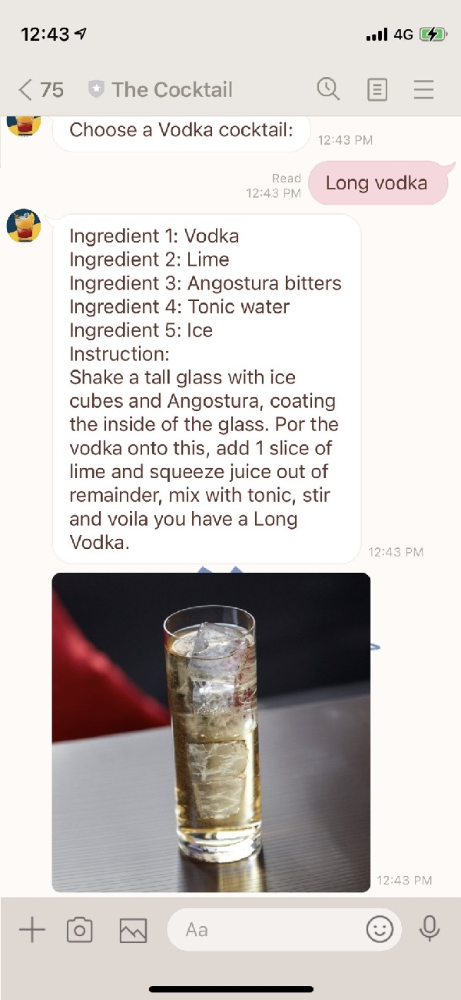
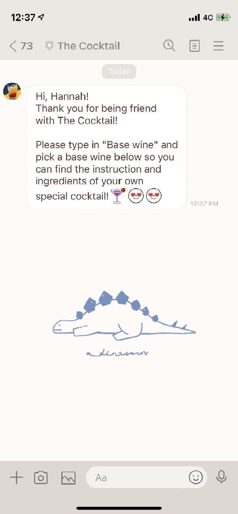
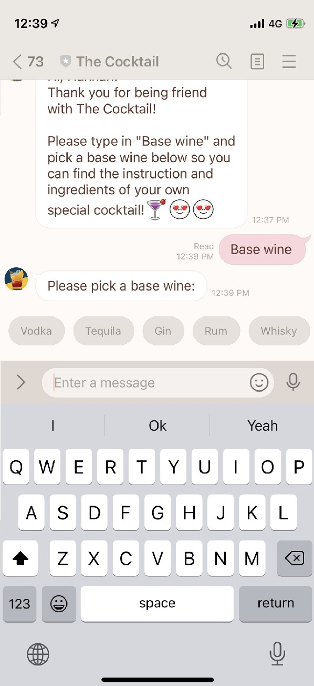
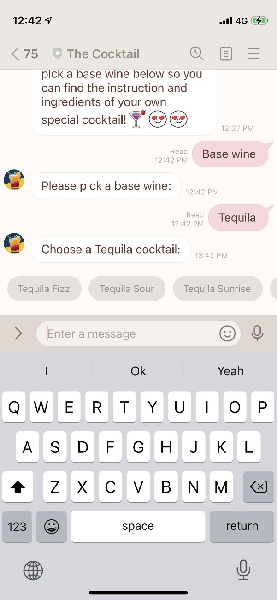
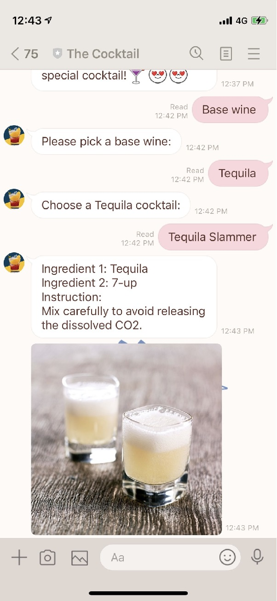

# Introduction - The Cocktails
The Cocktail is a Chatbot built in Python with Flask and ngrok.
Database scraped from [TheCocktailDB](https://www.thecocktaildb.com/api.php) API, using requests and json.
By choosing a base wine, You can find your own cocktails and their instructions and ingredients.
Welcome to join with The Cocktail!


# Build Process
1. Build up LINE Bot with Flask.
2. Use the [API](https://www.thecocktaildb.com/api.php) (TheCocktailDB) to access the data.
3. Data Pre-Processing
4. Connect LINE Bot and Python file through ngrok.
5. Run the Python file, and the data will display on the LINE Bot.

# Details of the Approach
**1. Build up LINE Bot with Flask.**
  * Before building up the LINE Bot, we need to download and import necessary libraries, such as Flask, line-bot-sdk, etc.
     * Flask
       
       `from flask import Flask`
     * line-bot-sdk
       
       `line-bot-sdk == 1.8.0`
    
  * Import libraries.
    * Flask
      
      `from flask import Flask`
    * line-bot-sdk
      ```
      from linebot import  LineBotApi, WebhookHandler
      from linebot.exceptions import InvalidSignatureError
      from linebot.models import MessageEvent, TextMessage,TextSendMessage, ImageSendMessage, StickerSendMessage, LocationSendMessage, QuickReply, QuickReplyButton, MessageAction
      ```
  * Build up LINE Bot through officially instruction websites.
     > [Getting started to use Messaging API](https://developers.line.biz/zh-hant/docs/messaging-api/getting-started/)
     
     > [Building-bot](https://developers.line.biz/zh-hant/docs/messaging-api/building-bot/)

**2. Use the [API](https://www.thecocktaildb.com/api.php) (TheCocktailDB) to access the data.**
  * Since the API is free, and it does not need an API Key to use, we can access the data through the URLs directly.

**3. Data Pre-Processing**
  * Before the Data Pre-Processing, installation of the project's dependencies is necessary.
    * Install requests.
      
      `pip install requests`
    * Install json.
      
      `pip install json`
      
  * Import the libraries.
      * Import requests.
       
        `import requests`
      * Import json.        
       
        `import json`
   * Deal with json format from [TheCocktailDB](https://www.thecocktaildb.com/api.php).

**4. Connect LINE Bot and Python file through ngrok.**
  * We also need to download [ngrok](https://ngrok.com/download) as the server.
  * Setting up ngrok and connect LINE Bot and Python file with it.
      >[ngrok教學1](https://blog.alantsai.net/posts/2018/04/devtooltips-5-ngrok-allow-public-to-access-localhost-website-and-sql-server)
      
      >[ngrok教學2](https://learn.markteaching.com/ngrok-webhook/)

**5. Now the data can display on LINE Bot!**

  

# Results
* Users can type in "Base wine" to start the journey of looking for their own cocktail.


* The Cocktail will show up six different liquor for users to choose as base wine.
  

* After users decide on the base wine, the system will give them many options made up by the base wine.


* As long as the cocktail selected, the system will reveal the instruction and ingredients of the cocktail.



# References
* API: LINE Bot, [TheCocktailDB](https://www.thecocktaildb.com/api.php)
    * [Getting started to use Messaging API](https://developers.line.biz/zh-hant/docs/messaging-api/getting-started/)
    * [Building-bot](https://developers.line.biz/zh-hant/docs/messaging-api/building-bot/)
    * [六步驟快速上手LINE Bot機器人](https://www.learncodewithmike.com/2020/06/python-line-bot.html)
    * [30天教你如何玩弄Line bot API](https://ithelp.ithome.com.tw/articles/10217402)

* Database: TheCocktailDB
    * [The Cocktail Database](https://holypython.com/api-12-cocktail-database/)

* Server: ngrok
    * [ngrok教學1](https://blog.alantsai.net/posts/2018/04/devtooltips-5-ngrok-allow-public-to-access-localhost-website-and-sql-server)
    * [ngrok教學2](https://learn.markteaching.com/ngrok-webhook/)

* Others
    * [Flask教學1](https://ithelp.ithome.com.tw/articles/10222132)
    * [Flask教學2](https://blog.techbridge.cc/2017/06/03/python-web-flask101-tutorial-introduction-and-environment-setup/)


